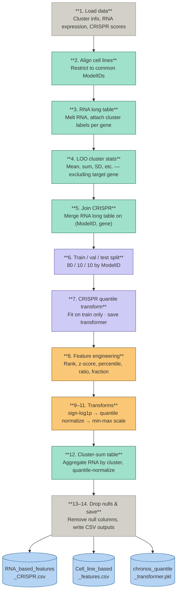

# **Latent Gene Dependency Prediction via Manifold Clustering
This project implements a hybrid R/Python pipeline to predict DepMap Chronos scores using biologically informed latent features. Instead of relying on raw expression matrices, the model uses manifold‑derived gene clusters to improve interpretability and predictive power.

🔬 Scientific Logic
Standard gene‑by‑gene modeling often misses functional redundancy across pathways. This pipeline addresses that by combining correlation structure, manifold learning, and attention‑based + FiLM deep modeling.

Correlation Mapping — Identify transcriptional correlates of gene dependency [RNA vs CRISPR]

Manifold Learning — Reduce the dependency–expression space

Latent Feature Engineering — Group genes into ~1,850 functional clusters

Attention+FiLM‑Based Prediction — Learn which gene modules drive cell‑line‑specific vulnerabilities

##Project Structure


```text
gene_dependency_prediction/                                  
├── outputs/
│   ├── clustering
│   ├── RNA_fetures
│   ├── H5_model_data
│   ├── model_training 
├── src/
│   ├── utils_correlation.R                # Speed optimized correlation functions
│   ├── utils_manifold_clustering.py       # UMAP + DBSCAN clustering
│   ├── utils_feature_engineering.py       # PyTorch Attention Network architecture
│   ├── utils_hdf5_builder.py              # H5 file functions preparation
│   └── utils_RNAbased_crispr_model.py     # PyTorch Attention+FiLM Network architecture
├── scripts/
│   ├── s01_run_depmap_corr_analysis.R     # R driver for correlation computation
│   ├── s02_manifold_clustering.py         # biology driven UMAP+DBscan clustering
│   ├── s03_feature_engineering.py         # Feature engineering, cell line features and CRISPRed gene features 
│   ├── s04_build_hdf5.py                  # preparation of H5 file to work with ~7M samples
│   └── s05_train_RNAbased_CRISPR_model.py # model training
├── environment.yml                        # Conda environment configuration
└── README.md
```


##Getting Started
1. Prerequisites
Place the following DepMap 25Q3 datasets into data/raw/:

Expression_Public_25Q3_subsetted.csv [too big, not provided]
CRISPR_Chronos_subsetted.csv [too big, not provided]

2. Environment Setup
bash
conda env create -f environment.yml
conda activate depmap-env

3. Running the Pipeline
Step 1 — Correlation Calculation (R, used R for fun)
Computes Spearman correlations between CRISPR sensitivity and RNA expression.
this step take very long time because the matrix is ~17000 (RNA) x 17000(CRISPR) gene.
Highly optimized for high speed to run it on labtop mith mith multiple cores.

Usage:
bash
Rscript scripts/01_run_cor.R

Step 2 — manifold clustering (Python)
Driver for the UMAP + DBSCAN gene clustering step.
Runs UMAP, DBscan clustering and asigned each RNA to a specific cluster. This step is crutial for for further workflow because it generates the basis for identification of closly related gene. Cluster identtified in this step will help to reduce the dimentinality and at the same time create a bases to find non-linear interactoins between cripred gene and cell lines state

Usage:
bash
python scripts/s02_manifold_clustering.py

Output:
Selected_RNA_CRISPR.pkl: A Python pickle file containing two sets of genes that passed the quality control filters:
crispr_gene: Genes meeting the activity/inactivity diversity threshold.
rna_gene: Genes meeting the variance threshold (including the CRISPR genes).
clusters.csv (generated by save_clusters): A mapping of gene identifiers to their assigned DBSCAN cluster labels, along with their coordinates in the UMAP manifold.

cluster_histogram.png: A frequency distribution plot showing the number of genes assigned to each cluster identified by DBSCAN.
umap_plot.png: A 2D scatter plot visualizing the manifold projection of genes, color-coded by their cluster membership.
highlight_[GENE_NAME].png: Individual plots for each gene specified in the HIGHLIGHT_GENES configuration list (e.g., MET, EGFR, MYC, TP53). These highlight the specific location of these genes within the UMAP manifold to provide biological context to the clusters.

Notes on Output Generation
Directory Structure: All outputs are saved to outputs/clustering/.
Naming Convention: The visualizations are generated based on the parameters set in the CONFIG block, specifically reflecting the UMAP dimensionality reduction parameters (e.g., PCA_COMPONENTS, UMAP_METRIC, UMAP_NEIGHBORS).
RAM Usage: Because this script performs a pivot operation on large correlation matrices, it utilizes dask to manage memory usage efficiently during the conversion from long to wide format.

Step 3 — feature_engineering (Python)
This step uses clusters to compute RNA-based cell line features and RNA-based gene
features for each CRISPRed gene in the data. Devisoin to cell line features and gene features
allows to implement attantion deep learning techniqur to utilise interactions non-linear interactions
effecting gene dependency sensitivity.



Usage:
bash
python scripts/s03_feature_engineering.py

Outputs
RNA_based_features_CRISPR.csv: The primary gene-level feature matrix.
Content: Contains RNA expression features, cluster-specific statistics (e.g., leave-one-out metrics), and transformed CRISPR scores for every gene-cell line combination.
Structure: Includes a split column, which categorizes data into train, val, and test sets based on cell lines to ensure robust evaluation.
Cell_line_based_features.csv: A cluster-sum wide table.
chronos_quantile_transformer.pkl: A serialized scikit-learn QuantileTransformer.Crucial for evaluation; it stores the transformation parameters fitted on the training set, allowing you to inverse-transform the predicted CRISPR scores back into the original scale for interpretation.


Step 4 — H5 data file (Python)
This step uses clusters to compute RNA-based cell line features and RNA-based gene features for each CRISPRed gene in the data. Devisoin to cell line features and gene features allows to implement attantion deep learning techniqur to utilise interactions non-linear interactions
effecting gene dependency sensitivity. Pipeline step 3 — build the gene-level feature matrix and cluster-sum table.

Run from the project root:
    python scripts/s03_feature_engineering.py

model_H5_data.h5: A comprehensive HDF5 file containing the structured data needed to train and evaluate your models.

Output: 
Content:This file stores normalized cell-line features (cl_feats), gene-level features (gene_feats), and the target CRISPR dependency scores (crispr_vals).
Metadata: It includes critical indexing and statistical metadata, such as normalization parameters (means and standard deviations) and the pre-computed train/val/test indices, ensuring consistency between training and inference.

Key Orchestration Steps
The script performs a final verification and compilation sequence:
Data Validation: Ensures consistency of ModelID identifiers between cell-line and gene-level datasets.
Normalization: Computes feature statistics (training set only) to prevent data leakage and applies scaling and imputation to the entire dataset.
Indexing: Extracts formal train/val/test masks for both gene-level records and cell-line groupings, facilitating proper data partitioning.
Verification: Performs an integrity check on the generated HDF5 file to ensure all datasets are correctly written and accessible before the modeling phase.

Step 4 — attantion+Film model training (Python)
Running this training script generates several artifacts essential for model persistence, evaluation, and resuming training:
Key Methodology: Attention Mechanism
The Attention Network extracts cluster‑level feature importance, enabling biological conceptiualizatoin and interpretation.

model structure:

```mermaid
graph LR
    subgraph "Input Layer"
        GF[Gene Features] --> G_ENC(Gene Encoder)
        CF[Cell Features] --> C_TOK(Cell Tokenizer)
    end

    subgraph "Biologically Grounded Attention"
        G_ENC --> G_EMB[Gene Embedding]
        C_TOK --> C_TOK_SEQ[Cell Token Sequence]
        G_EMB -.->|Query| CA1(Cross-Attention 1)
        C_TOK_SEQ -.->|K, V| CA1
        CA1 --> CA2(Cross-Attention 2)
        CA2 --> C_CTX[Refined Context]
    end

    subgraph "FiLM-Conditioned Trunk"
        C_CTX --> MRG(Merge)
        G_EMB --> COND(Conditioning)
        MRG --> RES1(Residual Blocks)
        COND -.-|FiLM Modulation| RES1
    end

    subgraph "Output"
        RES1 --> HEAD(Head)
        G_EMB -.-> BYP(Linear Bypass)
        BYP --> ADD((+))
        HEAD --> ADD
        ADD --> OUT[Prediction]
    end


Dynamic Loss Weighting: Employs a dynamic alpha parameter that uses a cosine schedule to transition between MSE-focused training and Pearson-correlation-focused training.

Mixed Precision & Clipping: Utilizes torch.amp (Automatic Mixed Precision) and gradient clipping to maintain stability during training.

Differential Weight Decay: Applies different weight decay rates to the projection/head layers and the core model parameters to optimize convergence for extreme dependency scores.

Early Stopping: Monitors the per-CL Pearson metric to automatically cease training if no improvement is seen over the defined PATIENCE period.

Evaluation in Chronos Space: Uses the previously generated QuantileTransformer to report metrics in the original "Chronos" dependency scale, providing biologically meaningful performance feedback.

Output:
a) Model Weights & Checkpoints
crispr_checkpoint.pt: A full training checkpoint. It contains the model weights, optimizer/scheduler states, and current metadata (epoch, best metrics, patience counter), allowing training to be resumed from the exact state of a previous run.

crispr_best_pearson_model.pt: The model weights corresponding to the epoch that achieved the highest performance on the per-cell-line (per-CL) Pearson correlation metric.

crispr_model_weights_final.pt: The final model state after training has concluded (either via reaching the epoch limit or early stopping).

b) Training Metrics
training_history.csv: A comprehensive per-epoch log.

Included Metrics: Learning rate, training and validation loss, batch-level Pearson scores, and global evaluation metrics (MAE, RMSE, global Pearson, mean/SD of per-CL Pearson).

Purpose: Used to visualize training stability and identify potential overfitting.

Notes for README.md
Prerequisites: This script requires model_H5_data.h5 and the chronos_quantile_transformer.pkl file generated by previous pipeline steps.
Hardware: The script is optimized for CUDA-enabled GPUs; ensure your environment is configured for torch training.
Configuration: All hyperparameters (learning rate, architecture dimensions, dropout, etc.) are encapsulated in the CONFIG block at the top of the file.


📈 Results & Medium Blog (in progress yet)
A full breakdown of biological insights and model performance is available here:
Medium Article

