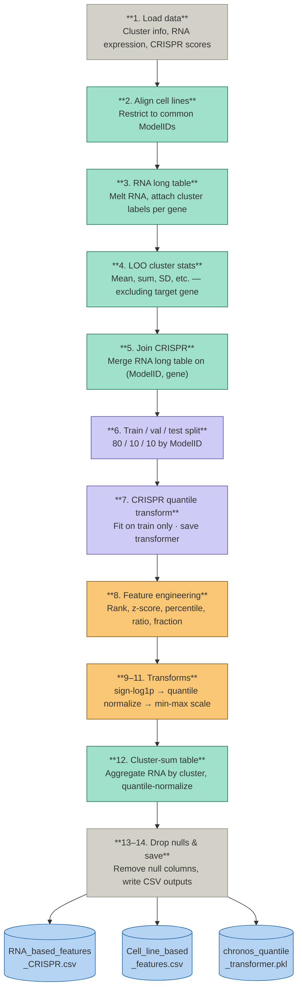
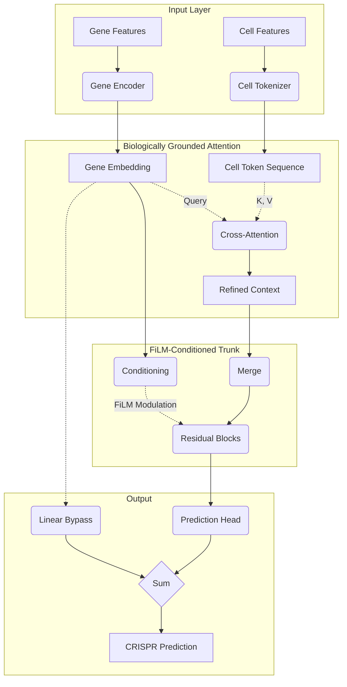

# Latent Gene Dependency Prediction via Manifold Clustering

> A hybrid R/Python pipeline that predicts DepMap Chronos gene dependency scores using biologically informed latent features derived from RNA expression/CRISPR correlation manifold clustering.

---

## Table of contents

- [Scientific rationale](#scientific-rationale)
- [Project structure](#project-structure)
- [Getting started](#getting-started)
  - [Prerequisites](#prerequisites)
  - [Environment setup](#environment-setup)
- [Pipeline](#pipeline)
  - [Step 1 — Correlation mapping (R)](#step-1--correlation-mapping-r)
  - [Step 2 — Manifold clustering (Python)](#step-2--manifold-clustering-python)
  - [Step 3 — Feature engineering (Python)](#step-3--feature-engineering-python)
  - [Step 4 — HDF5 data preparation (Python)](#step-4--hdf5-data-preparation-python)
  - [Step 5 — Model training (Python)](#step-5--model-training-python)
- [Model architecture](#model-architecture)
- [Results](#results)

---

## Scientific rationale

Standard gene-by-gene dependency modeling often misses functional redundancy across biological pathways. This pipeline addresses that limitation by combining RNA/CRISPR correlation structure, manifold learning, and an attention-based deep learning architecture with FiLM conditioning.


The four key ideas:

| Stage | Description |
|---|---|
| **Correlation mapping** | Identifies transcriptional correlations of gene dependency (RNA vs CRISPR) |
| **Manifold learning** | Reduces the high-dimensional dependency–expression space |
| **Latent feature engineering** | Groups genes into 2388 functional clusters in RNA space |
| **Attention + FiLM prediction** | Learns which gene modules drive cell-line-specific vulnerabilities |

---

## Project structure

```text
gene_dependency_prediction/
├── outputs/
│   ├── clustering/            # UMAP plots, cluster assignments
│   ├── RNA_features/          # Feature matrices
│   ├── H5_model_data/         # HDF5 training files
│   └── model_training/        # Checkpoints, metrics, weights
├── src/
│   ├── utils_correlation.R                  # Speed-optimised correlation functions
│   ├── utils_manifold_clustering.py         # UMAP + DBSCAN clustering
│   ├── utils_feature_engineering.py         # Feature engineering utilities
│   ├── utils_hdf5_builder.py                # HDF5 file preparation
│   └── utils_RNAbased_crispr_model.py       # Attention + FiLM network architecture
├── scripts/
│   ├── s01_run_depmap_corr_analysis.R        # Correlation computation driver
│   ├── s02_manifold_clustering.py            # PCA + UMAP + DBSCAN clustering
│   ├── s03_feature_engineering.py            # Cell-line and gene feature engineering
│   ├── s04_build_hdf5.py                     # HDF5 file builder (~7M samples)
│   └── s05_train_RNAbased_CRISPR_model.py    # Model training
├── environment.yml
└── README.md
```

---

## Getting started

### Prerequisites

Download the following [DepMap 25Q3](https://depmap.org/portal/) datasets and place them in `data/raw/`:

| File | Note |
|---|---|
| `Expression_Public_25Q3_subsetted.csv` | Not included — too large |
| `CRISPR_Chronos_subsetted.csv` | Not included — too large |

### Environment setup

```bash
conda env create -f environment.yml
conda activate depmap-env
```

---

## Pipeline

### Step 1 — Correlation mapping (R)

Computes Spearman correlations between CRISPR sensitivity and RNA expression across the full ~17,000 × 17,000 gene matrix. The implementation is multi-core optimised to run on a laptop.

```bash
Rscript scripts/s01_run_depmap_corr_analysis.R
```

> ⚠️ This step is computationally intensive. Runtime depends on the number of available cores. (takes several days on a regular laptop)

---

### Step 2 — Manifold clustering (Python)

Runs PCA + UMAP dimensionality reduction followed by DBSCAN clustering to assign each RNA gene to a functional cluster. This step is critical — it generates the biological groupings that underpin all downstream feature engineering and non-linear modelling.

```bash
python scripts/s02_manifold_clustering.py
```

**Outputs** (saved to `outputs/clustering/`):

| File | Description |
|---|---|
| `Selected_RNA_CRISPR.pkl` | Genes passing QC: `crispr_gene` (activity diversity threshold) and `rna_gene` (variance threshold) |
| `UMAP_with_clusters.csv` | Gene-to-cluster mapping with 2D UMAP coordinates |
| `cluster_histogram.png` | Frequency distribution of genes per cluster |
| `umap_plot.png` | 2D UMAP scatter coloured by cluster membership |
| `highlight_[GENE_NAME].png` | Per-gene UMAP highlights for selected genes (e.g. MET, EGFR, MYC, TP53) |

> **Note on memory:** The correlation matrix pivot is performed via `dask` for efficient out-of-core memory management.

---

### Step 3 — Feature engineering (Python)

Computes RNA-based gene features and cell-line features for every CRISPRed gene. Separating gene-level and cell-line-level representations enables the cross-attention mechanism in the downstream model to exploit non-linear interactions driving dependency sensitivity.

```bash
python scripts/s03_feature_engineering.py
```

**Pipeline internals:**



**Outputs** (saved to `outputs/RNA_features/`):

| File | Description |
|---|---|
| `RNA_based_features_CRISPR.csv` | Gene-level feature matrix with leave-one-out cluster stats, transformed CRISPR target, and `split` column |
| `Cell_line_based_features.csv` | Cluster-sum wide table per cell line with `split` column |
| `chronos_quantile_transformer.pkl` | Fitted `QuantileTransformer` — required for inverse-transforming predictions back to Chronos scale at evaluation |

---

### Step 4 — HDF5 data preparation (Python)

Compiles all feature matrices into a single HDF5 file optimised for loading ~7M gene–cell-line samples during training.

```bash
python scripts/s04_build_hdf5.py
```

**Key steps:**

1. **Validation** — ensures `ModelID` consistency between cell-line and gene-level datasets
2. **Normalisation** — computes mean/SD statistics on the training split only (no data leakage)
3. **Indexing** — extracts formal train/val/test masks for both gene records and cell-line groupings
4. **Integrity check** — verifies all HDF5 datasets are correctly written before the modelling phase

**Output** (`outputs/H5_model_data/model_H5_data.h5`):

| Dataset | Content |
|---|---|
| `cl_feats` | Normalised cell-line features |
| `gene_feats` | Gene-level features |
| `crispr_vals` | Target CRISPR dependency scores |
| Metadata | Normalisation parameters, train/val/test indices |

---

### Step 5 — Model training (Python)

Trains the Attention + FiLM network. Requires `model_H5_data.h5` and `chronos_quantile_transformer.pkl` from earlier steps. A CUDA-enabled GPU is strongly recommended.

```bash
python scripts/s05_train_RNAbased_CRISPR_model.py
```

**Training features:**

| Feature | Details |
|---|---|
| **Dynamic loss weighting** | Cosine schedule transitions from MSE-focused to Pearson-correlation-focused training |
| **Mixed precision** | `torch.amp` with gradient clipping for numerical stability |
| **Differential weight decay** | Separate decay rates for projection/head layers vs core model parameters |
| **Early stopping** | Monitors per-cell-line Pearson correlation; stops after `PATIENCE` epochs without improvement |
| **Chronos-space evaluation** | Inverse-transforms predictions via the saved `QuantileTransformer` for biologically meaningful metrics |

> All hyperparameters (learning rate, architecture dimensions, dropout, etc.) are defined in the `CONFIG` block at the top of the training script.

**Outputs** (saved to `outputs/model_training/`):

| File | Description |
|---|---|
| `crispr_checkpoint.pt` | Full checkpoint — model weights, optimiser/scheduler state, epoch metadata. Use to resume training. |
| `crispr_best_pearson_model.pt` | Weights from the epoch with the highest per-cell-line Pearson correlation |
| `crispr_model_weights_final.pt` | Final model state after training concludes |
| `training_history.csv` | Per-epoch log: LR, train/val loss, Pearson scores, MAE, RMSE |

---

## Model architecture



The cross-attention mechanism allows the model to learn which gene clusters are most informative for predicting dependency in a given cell line, providing a biologically interpretable attention map alongside predictions.

---

## Results

> 📝 A full breakdown of biological insights and model performance is in progress.
>
> **Medium article:** *(coming soon)*
